# Mini-SOC Open Source

[](./elk/)
[](./thehive/)
[](./opencti/)
[](./suricata/)
[](./winlogbeat/)

Stack SOC open source complete deployee sur 3 machines physiques.
Detection reseau (Suricata IDS) + detection endpoint (Winlogbeat/Sysmon) +
SIEM (ELK 8.13) + reponse aux incidents (TheHive 4) +
enrichissement automatique (Cortex 3) + Threat Intelligence (OpenCTI 6).

Tout est fonctionnel et teste avec de vrais scenarios d'attaque simules localement.
La chaine complete est automatisee : de la detection a l'enrichissement Cortex.

---

## Architecture

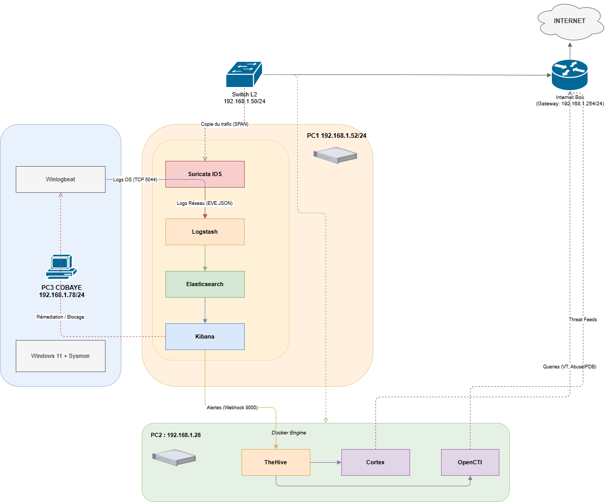

| Machine | Role | CPU | RAM | Stack |
| :--- | :--- | :--- | :--- | :--- |
| **PC1** | SIEM + IDS | i7-1355U | 16 Go | ELK 8.13 + Suricata 7 (WSL2) |
| **PC2** | SOAR + CTI | i5-6500 | 12 Go | TheHive 4 + Cortex 3 + OpenCTI 6 |
| **PC3** | Cobaye | - | - | Windows 11 + Sysmon + Winlogbeat |

---

## Flux de donnees

```
[PC3 - Windows 11]                    [PC1 - WSL2]
  Sysmon + Winlogbeat                   Suricata IDS
  Events Windows                        49 864 regles ET
          |                                   |
          | Beats port 5044                   | Filebeat eve.json
          v                                   v
[PC1 - Logstash]  <----------  [PC1 - Elasticsearch 8.13]
  Parsing + enrichissement           Stockage + indexation
                                             |
                                             v
                                   [PC1 - Kibana SIEM]
                                   6 regles de detection
                                   MITRE ATT&CK mapping
                                             |
                                             | Webhook automatique
                                             v
                                   [PC2 - TheHive 4]
                                   Cases automatiques
                                   Workflow analyste IR
                                             |
                                             | auto-analyze.ps1
                                             v
                                   [PC2 - Cortex 3]
                                   AbuseIPDB, VirusTotal,
                                   MaxMind GeoIP, TorProject
                                             |
                                             v
                                   [PC2 - OpenCTI 6]
                                   30 000 objets STIX 2.1
                                   184 groupes APT, 816 malwares
```

---

## Apercu

### Dashboard Kibana SIEM - Security Overview
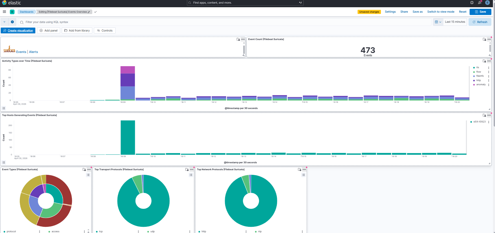

### Dashboard Filebeat Suricata - trafic reseau analyse
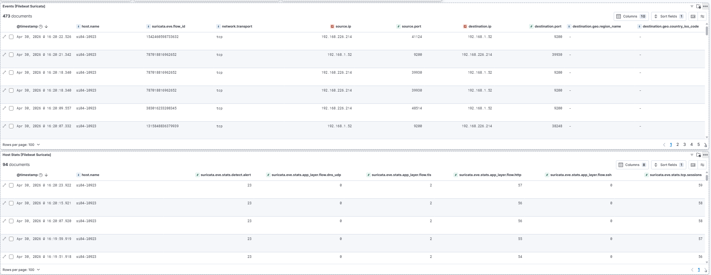

### 6 Regles de detection actives - toutes succeeded
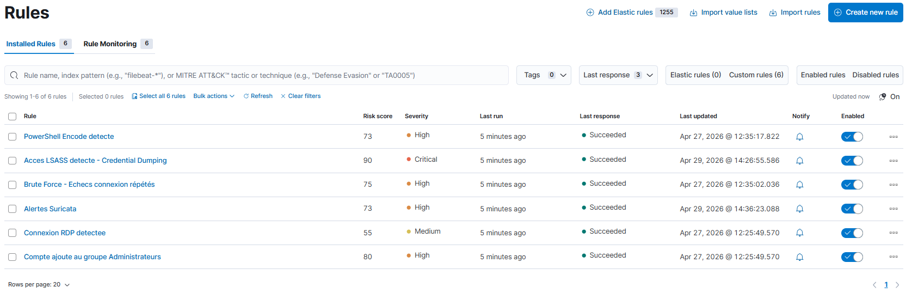

### Alertes Windows detectees (Brute Force, PowerShell, LSASS, RDP)
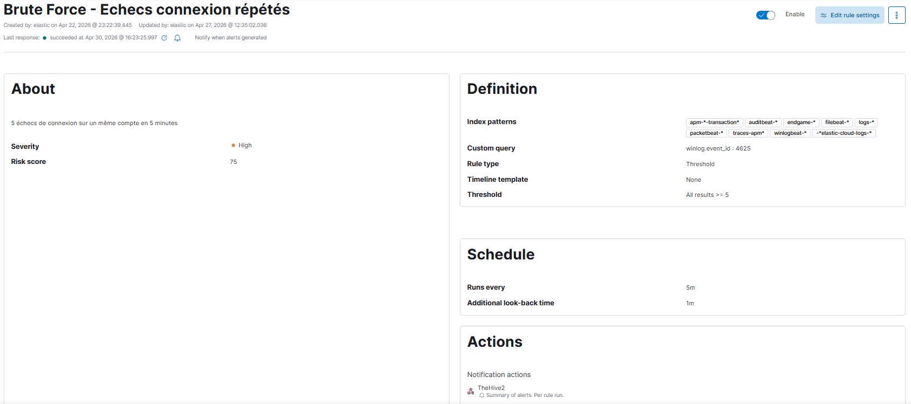

### Alertes reseau Suricata
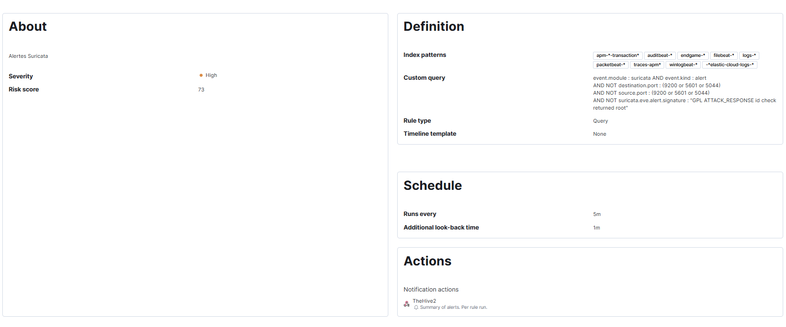

### Timeline d'attaque - 19 evenements en 22 secondes
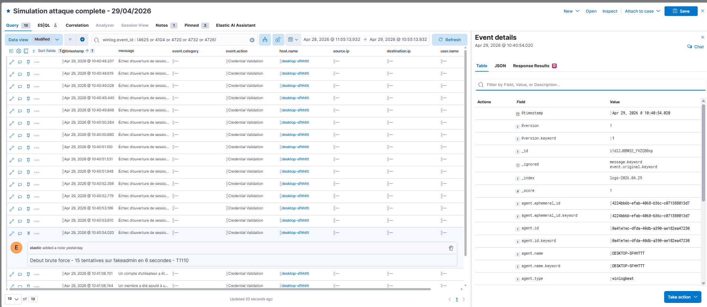

### Cases TheHive crees automatiquement via webhook Kibana
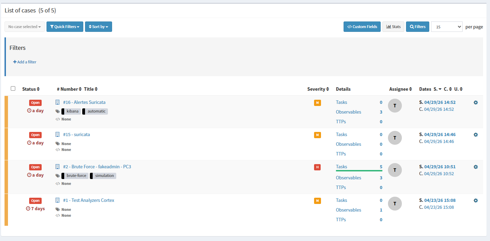

### Case Brute Force - workflow analyste complet
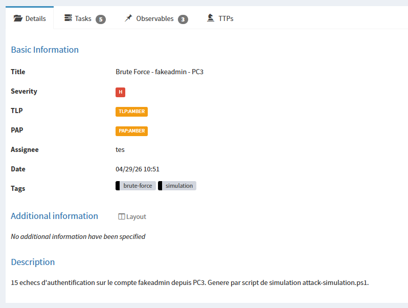

### Case Suricata - 3 observables enrichis par Cortex (AbuseIPDB + VirusTotal)
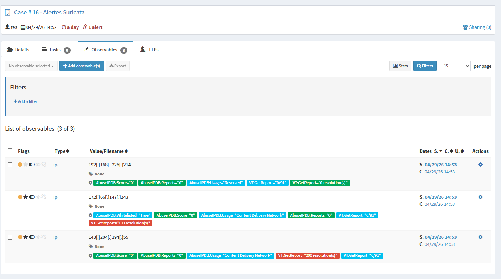

### Detail observable - analyzers Cortex disponibles
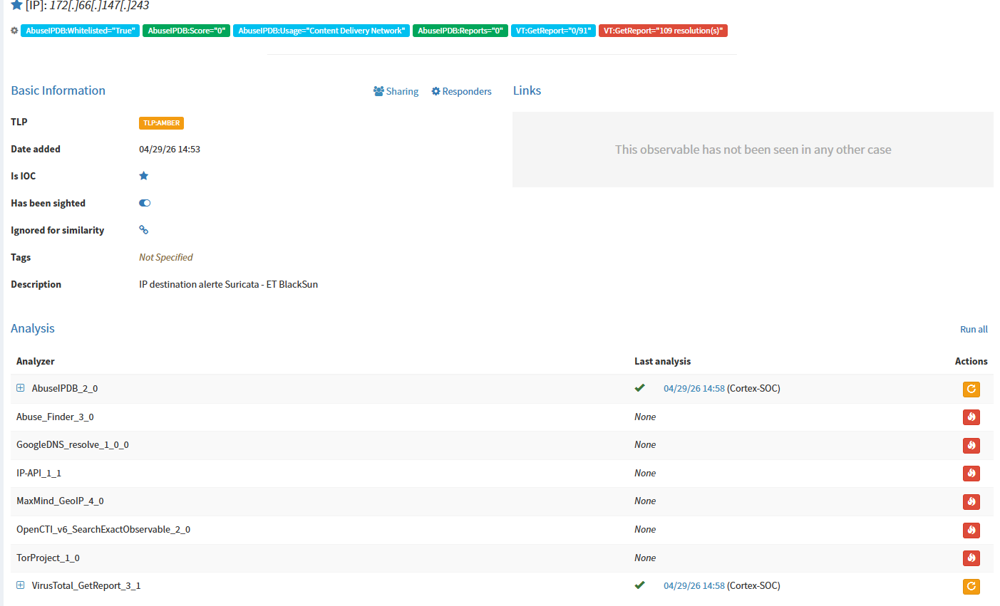

### Alertes TheHive creees automatiquement depuis Kibana (tags: kibana, automatic)
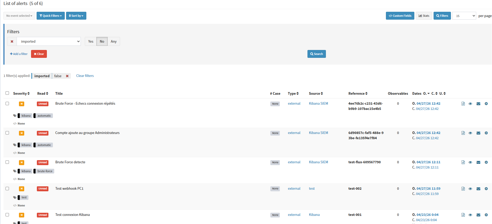

### Suricata IDS - alertes reseau en temps reel dans WSL2
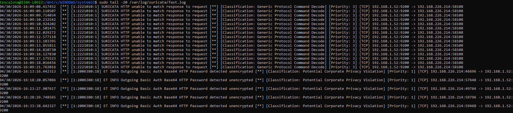

### OpenCTI - 184 groupes APT, 816 malwares, 1 rapport de menace
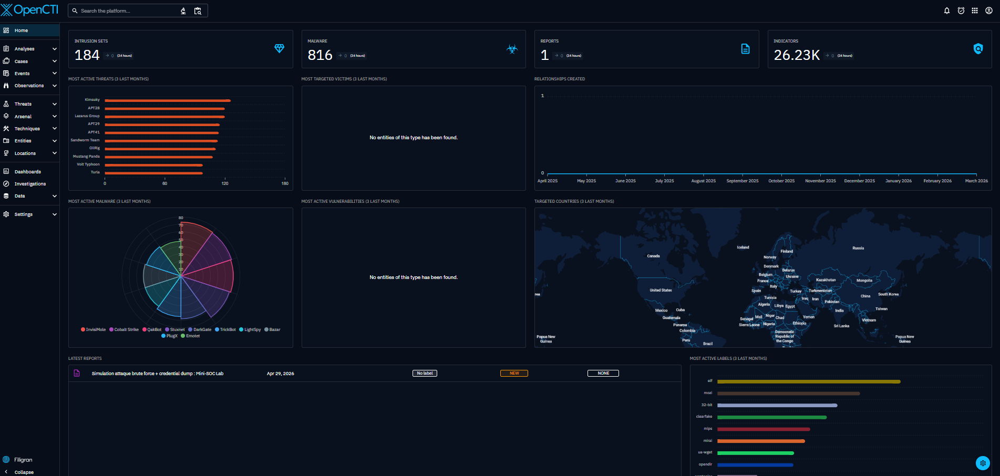

### OpenCTI - 1.49K techniques MITRE ATT&CK importees
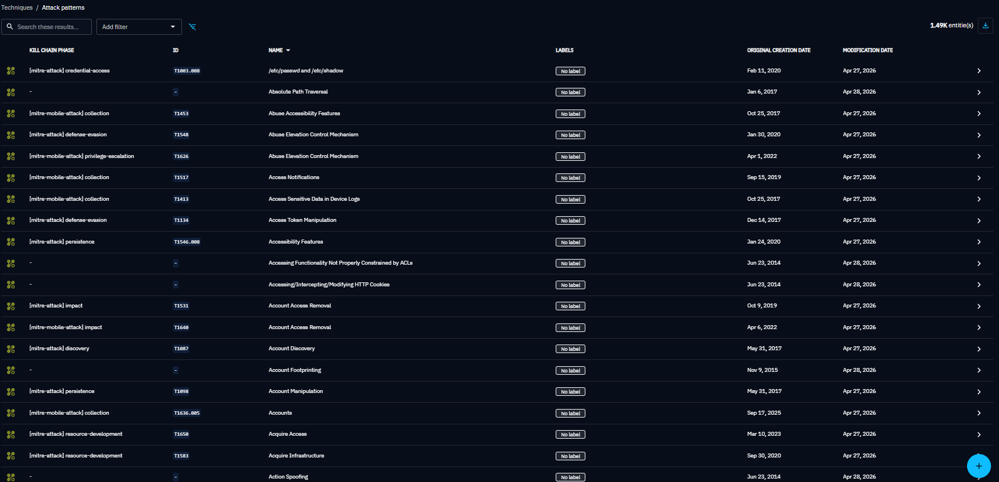

### OpenCTI - Acteur Lab Attacker lie a T1110, T1059.001, T1003.001
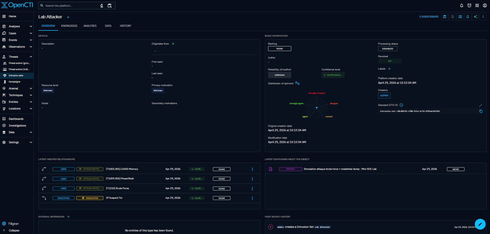

### OpenCTI - Rapport de menace STIX 2.1 exporte
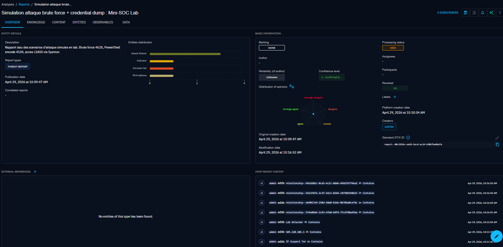

---

## Detection : regles Kibana SIEM

### Regles Windows (Winlogbeat + Sysmon)

| Regle | Event ID | Severite | MITRE |
| :--- | :--- | :--- | :--- |
| Brute Force (threshold >= 5) | 4625 | High | T1110 |
| PowerShell encode | 4104 | High | T1059.001 |
| Acces LSASS - Credential Dumping | Sysmon 10 | Critical | T1003.001 |
| Connexion RDP detectee | 4624 LogonType 10 | Medium | T1021.001 |
| Compte ajoute groupe Admins | 4732 | High | T1078.003 |

### Regles reseau (Suricata + Filebeat)

| Regle | Source | Severite | Description |
| :--- | :--- | :--- | :--- |
| Alertes Suricata | filebeat-* | High | 49 864 signatures Emerging Threats |

---

## Services

| Service | Port | Identifiant |
| :--- | :--- | :--- |
| Kibana | `http://PC1:5601` | elastic |
| TheHive | `http://PC2:9000` | admin@thehive.local |
| Cortex | `http://PC2:9001` | admin |
| OpenCTI | `http://PC2:8080` | admin@soc.local |

---

## Demarrage rapide

```bash
# PC1 - ELK
cd elk && docker compose up -d

# PC2 - SOAR + CTI (dans cet ordre)
cd thehive && docker compose up -d
cd ../opencti && docker compose up -d
```

Suricata sur PC1 (WSL2) :
```bash
bash scripts/suricata-start.sh
```

Guide complet : [docs/installation.md](./docs/installation.md)

---

## Automatisation complete

```
Suricata detecte -> Filebeat -> Elasticsearch -> Kibana rule
-> Webhook -> TheHive case -> auto-analyze.ps1 -> Cortex (AbuseIPDB + VirusTotal)
```

---

## Analyzers Cortex actifs

| Analyzer | Type | Utilite |
| :--- | :--- | :--- |
| AbuseIPDB_2_0 | IP | Score reputation, signalements |
| VirusTotal_GetReport_3_1 | IP/Hash/URL | 91 moteurs |
| MaxMind_GeoIP_4_0 | IP | Geolocalisation |
| TorProject_1_0 | IP | Noeuds Tor |
| IP-API_1_1 | IP | ASN, organisation |
| Abuse_Finder_3_0 | IP/Domain | Contacts abuse |
| GoogleDNS_resolve_1_0_0 | Domain | DNS passif |

---

## Travaux pratiques realises

### Phase A - OpenCTI
- Import MITRE ATT&CK : 29 991 objets STIX, 953 442 relations, 1.49K techniques
- 184 groupes APT, 816 malwares indexes
- Acteur **Lab Attacker** + rapport STIX 2.1 exporte

### Phase B - TheHive / Cortex
- Workflow analyste complet : Investigation > Containment > Eradication > Recovery > Lessons Learned
- AbuseIPDB score 100/100 sur noeud Tor 185.220.101.1
- Script `auto-analyze.ps1` : enrichissement automatique

### Phase C - Kibana SIEM
- Dashboard 6 panels
- Timeline 19 evenements en 22 secondes

### Phase D - Suricata IDS
- 49 864 regles Emerging Threats
- Chaine complete : Suricata -> ELK -> TheHive -> Cortex validee

---

## Structure du repo

```
.
|-- elk/                          # PC1 - SIEM
|   |-- docker-compose.yml
|   -- logstash/
|       |-- config/logstash.yml
|       -- pipeline/main.conf
|-- thehive/                      # PC2 - SOAR
|   |-- docker-compose.yml
|   -- Dockerfile-cortex
|-- opencti/                      # PC2 - CTI
|   -- docker-compose.yml
|-- suricata/                     # PC1 - IDS
|   -- suricata-config-notes.md
|-- winlogbeat/                   # PC3 - Collecte
|   -- winlogbeat.yml
|-- detection-rules/
|   -- detection-rules.md
|-- scripts/
|   |-- attack-simulation.ps1
|   |-- healthcheck.ps1
|   |-- auto-analyze.ps1
|   |-- install-auto-analyze-task.ps1
|   -- suricata-start.sh
|-- docs/
|   |-- installation.md
|   |-- screenshots/
|   -- stix-exports/
|-- .env.example
-- .gitignore
```

---

## Stack complete

```
SIEM     : Elasticsearch 8.13 + Logstash 8.13 + Kibana 8.13
IDS      : Suricata 7.0.3 (WSL2) + 49 864 regles Emerging Threats
SOAR     : TheHive 4.1.24 + Cortex 3.1.8
CTI      : OpenCTI 6.0.5 + MITRE/URLhaus/MalwareBazaar
Collecte : Winlogbeat 8.13 + Sysmon + Filebeat 8.x
Infra    : Docker + WSL2 + Windows 11
```

---

## Ce qui pourrait etre ajoute

- Regles Sigma converties en regles Kibana (sigma-cli)
- Suricata en mode IPS pour bloquer le trafic malveillant
- Zeek pour l'analyse de protocoles reseau avancee
- Dashboard OpenCTI correlant IOCs Kibana et base CTI
- Authentification centralisee (SSO) entre les services